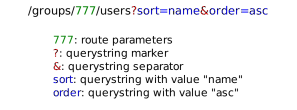

# Plan

- Introduction
- What is a Route ?
- Proper Routing
- Angular Router's Lifecycle
- Resolvers
- Resolver Example
- Live Demo
- Resolvers Advantages
- Spinner

---

## Plan

- Guarding your Routes

---

## Introduction

GitHub Repo: <https://github.com/groovytron/angular-routing-examples>

Please prepare your questions during the presentation and ask them at the end of the presentation.

---

## What is a route ?



List the users from group with ID `777` sorted by name ascendently.

---

## Proper Routing

- URLs that end-users can understand
- the state is in the route
  - no need to use state most of the time
  - all your app's pages are shareable through URLs
    - helps for testing, bug reporting and reproducibility, etc.

---

## Angular Router's Lifecycle I

Based on Angular's [documentation](https://angular.io/api/router/Event#description):

- *NavigationStart*: Navigation starts.
- *RouteConfigLoadStart*: Before the router lazy loads a route configuration.
- *RouteConfigLoadEnd*: After a route has been lazy loaded.
- *RoutesRecognized*: When the router parses the URL and the routes are recognized.
- *GuardsCheckStart*: When the router begins the guards phase of routing.

---

## Angular Router's Lifecycle II

- *ChildActivationStart*: When the router begins activating a route's children.
- *ActivationStart*: When the router begins activating a route.
- *GuardsCheckEnd*: When the router finishes the guards phase of routing successfully.
- *ResolveStart*: When the router begins the resolve phase of routing.
- *ResolveEnd*: When the router finishes the resolve phase of routing successfully.

---

## Angular Router's Lifecycle III

- *ChildActivationEnd*: When the router finishes activating a route's children.
- *ActivationEnd*: When the router finishes activating a route.
- *NavigationEnd*: When navigation ends successfully.
- *NavigationCancel*: When navigation is canceled.
- *NavigationError*: When navigation fails due to an unexpected error.
- *Scroll*: When the user scrolls.

---

## Resolvers: what is it ?

> Interface that classes can implement to be a data provider. A data provider class can be used with the router to resolve data during navigation. The interface defines a resolve() method that is invoked right after the ResolveStart router event. The router waits for the data to be resolved before the route is finally activated.

---

## Resolvers: TLDR

It used to be injectable classes that implements the `Resolve<T>` interface but since Angular 16 they are functions implementing the `ResolveFn<T>` function signature.

`T` is the type of data you expect from an HTTP call (or any (a)synchronous operation returning something) from the backend (eg. list of `User`, single `User`, etc.).

---

## Resolvers: example

[Full example link](https://github.com/groovytron/angular-routing-examples/blob/main/apps/resolver-example/src/app/core/resolver/list-users.resolver.ts)

```ts
export const listUsersResolver: ResolveFn<User[]> = ():
  | Observable<User[]>
  | Promise<User[]>
  | User[] => {
  const userService = inject(UserService);

  return userService.listUsers();
};
```

---

## Resolvers: example

[Full example link](https://github.com/groovytron/angular-routing-examples/blob/main/apps/resolver-example/src/app/app-routing.module.ts)

```ts
const withoutResolverUrl = 'without-resolver';

const routes: Route[] = [
  { path: withoutResolverUrl, component: WithoutResolverComponent },
  {
    path: 'with-resolver',
    component: WithResolverComponent,
    resolve: { users: listUsersResolver },
  },
  { path: '', pathMatch: 'full', redirectTo: withoutResolverUrl },
];

@NgModule({
  imports: [RouterModule.forRoot(routes, {enableTracing: true})],
  exports: [RouterModule],
})
export class AppRoutingModule {}
```

---

## Resolvers: example

[Full example link](https://github.com/groovytron/angular-routing-examples/blob/main/apps/resolver-example/src/app/components/with-resolver/with-resolver.component.ts)

```ts
@Component({
  selector: 'app-with-resolver',
  templateUrl: './with-resolver.component.html',
  styleUrls: ['./with-resolver.component.css'],
})
export class WithResolverComponent implements OnInit {
  users: User[] = [];

  constructor(private activeRoute: ActivatedRoute) {}

  ngOnInit(): void {
    this.users = this.activeRoute.snapshot.data['users'] as User[];
  }
}
```

---

## Live Demo

<a target="_blank" href="http://localhost:4200">http://localhost:4200</a>

---

## Resolvers Advantages

- You don't need to do the HTTP calls in your components
- When your component starts rendering the first time, the data is already there
- The mess with asynchronous variables (aka `Observable`s) is reduced

---

## Resolvers Advantages

- If data retrieval fails, the navigation is canceled so that the users don't navigate to a component that will error because the needed data could not be fetched
- It's useless to bring the user to a component that cannot be drawn because it doesn't have the data it needs to be rendered, right ?

---

## Resolvers Advantages

Components are simpler ⇨ components are easier to test !

---

## Resolvers on Steroids with a Spinner

As the router emits some events, why not listening to it and display a spinner while some operations are pending ?

- Fetching data from the backend
- Check if the user is allowed to access the page

---


---

## Centralized spinner example

[Full example link](https://github.com/groovytron/angular-routing-examples/blob/main/apps/spinner-example/src/app/app.component.ts)

```ts
@Component({
  selector: 'angular-routing-examples-root',
  templateUrl: './app.component.html',
  styleUrls: ['./app.component.scss'],
})
export class AppComponent implements OnInit, OnDestroy {
  readonly destroyed = new Subject<void>();

  constructor(
    private readonly router: Router,
    private readonly spinner: ObSpinnerService
  ) {}

  ngOnInit(): void {
    this.router.events
      .pipe(takeUntil(this.destroyed))
      .subscribe((event: Event) => {
        // list of router events: https://angular.io/api/router/RouterEvent
        switch (true) {
          case event instanceof NavigationStart:
          case event instanceof GuardsCheckEnd:
            this.spinner.activate();
            break;

          case event instanceof NavigationEnd:
          case event instanceof NavigationCancel:
          case event instanceof NavigationError:
          case event instanceof GuardsCheckStart:
            this.spinner.deactivate();
            break;
        }
      });
  }

  ngOnDestroy(): void {
    this.destroyed.next();
    this.destroyed.complete();
  }
}
```

---

## Live Demo

<a target="_blank" href="http://localhost:4201">http://localhost:4201</a>

---

## Conclusion

- Resolvers help developers to prefetch data from external sources
- Combined with a spinner, they smoothen the navigation for the user
- They simplify components' logic and make them easier to test
- Use them abondantly

---

## Questions


---

## Did you say check user access ?

Angular Guard:


---

## Guard: what is it ?

> Interface that a class can implement to be a guard deciding if a route can be activated. If all guards return true, navigation continues. If any guard returns false, navigation is cancelled. If any guard returns a UrlTree, the current navigation is cancelled and a new navigation begins to the UrlTree returned from the guard.

---

## Guard: TLDR

- guards are used to define if a user can navigate to another route (going to another page **or leaving a page**)

---

## Guard: TLDR

- guards can cancel a navigation if the required conditions are not fullfilled but it can also redirect the user to another page
  - it's sometimes better to:
    1. prevent the user to access the page if they are not allowed
    2. notify them that they cannot access the page and why
    3. if possible and necessary, redirect them to a page from which they can perform the actions they are allowed to do (eg. home page)

---

## Guard Example

The guard

```ts
export const authGuard: CanActivateFn = (
  route: ActivatedRouteSnapshot,
  state: RouterStateSnapshot
):
  | Observable<boolean | UrlTree>
  | Promise<boolean | UrlTree>
  | boolean
  | UrlTree => {
  const matDialog = inject(MatDialog);
  const notifications = inject(ObNotificationService);
  const router = inject(Router);

  const dialog = matDialog.open(LoginDialogComponent);

  return dialog.afterClosed().pipe(
    map((result: boolean | undefined | null) => {
      if (result === true) {
        return result;
      }

      notifications.error(
        'Oups ! You are not authenticated and cannot access this page.'
      );

      void router.navigateByUrl('/');

      return false;
    })
  );
};
```

---

## Guard Example

The login prompt implemented in a dialog:

```ts
@Component({
  selector: 'app-login-dialog',
  templateUrl: './login-dialog.component.html',
  styleUrls: ['./login-dialog.component.css'],
})
export class LoginDialogComponent {
  form = new FormGroup({
    password: new FormControl<string>('', {
      nonNullable: true,
      validators: [Validators.required],
    }),
  });

  constructor(private readonly dialog: MatDialogRef<LoginDialogComponent>) {}

  authenticate() {
    this.dialog.close(this.form.valid && this.form.value.password === 'secret');
  }
}
```

---

## Conclusion

- Use `ResolveFn` to preload data during navigation to simplify components code
- Use `CanActivateFn` to check user access and prevent them from accessing pages and features that are not allowed to access
  - It also simplifies components' logic as it's outside of them in a reusable function
- If something needs to be injected in a `ResolveFn` or a `CanActivateFn` (eg. a service, store, etc.) use `inject` to inject them and use them in your functions


---

## Sources

- <https://angular.io/api/router/Event>
- <https://angular.io/api/router/Resolve>
- <https://angular.io/api/router/ResolveFn>
- <https://angular.io/api/router/CanActivate>
- <https://angular.io/api/router/CanActivateFn>
- <https://angular.io/api/core/inject>
